# 웹/모바일(웹 기술) 스켈레톤 프로젝트

## 카테고리

| Application | Domain | Language | Framework |
| ---- | ---- | ---- | ---- |
| :white_check_mark: Desktop Web | :black_square_button: AI | :white_check_mark: JavaScript | :black_square_button: Vue.js |
| :black_square_button: ​Mobile Web | :black_square_button: Big Data | :black_square_button: TypeScript | :white_check_mark: React |
| :white_check_mark: Responsive Web | :black_square_button: Blockchain | :black_square_button: C/C++ | :black_square_button: Angular |
| :black_square_button: Android App | :black_square_button: IoT | :black_square_button: C# | :black_square_button: Node.js |
| :black_square_button: iOS App | :black_square_button: AR/VR/Metaverse | :black_square_button: Python | :black_square_button: Flask/Django |
| :black_square_button: Desktop App | :black_square_button: Game | :white_check_mark: Java | :white_check_mark: Spring/Springboot |
| | | :black_square_button: Kotlin | |

## 프로젝트 소개

* 프로젝트명 : Beyond Meetings
* 서비스 특징 : 회의가 서툰 사람들을 위한 "좋은 회의"를 할 수 있도록 도움을 주는 화상채팅 서비스
* 주요 기능
  - 회의 시작 전 정해둔 회의 시간을 넘기지 않도록 표시해준다.
  - 회의록 템플릿 제공
  - 회의에 도움이 될 수 있는 기능을 제공
  - 참여자가 각각 얼마나 발언했는지 말한 시간을 제공한다.
  - 다양한 회의 기법을 지원한다.
* 주요 기술
  - WebRTC
  - WebSocket
  - JWT Authentication
  - REST API
  - React
  - Spring Boot
  - MySQL
* 참조 리소스
  * Color Thief: 이미지 색상 추출 라이브러리. 커버 사진 색상 추출 및 배경 변경에 활용
  * Animation.css: CSS 애니메이션 지원 라이브러리. 메인 페이지 진입 애니메이션에 활용
* 배포 환경
  * NOT YET
  * URL: // 웹 서비스, 랜딩 페이지, 프로젝트 소개 등의 배포 URL 기입
  * 테스트 계정: // 로그인이 필요한 경우, 사용 가능한 테스트 계정(ID/PW) 기입

## 팀 소개
* 김병완 : Front-end, 팀장 
* 김소은 : Back-end 
* 박상훈 : Front-end
* 박주윤 : Front-end 
* 유진주 : Back-end  
* 이남수 : Back-end

## ERD

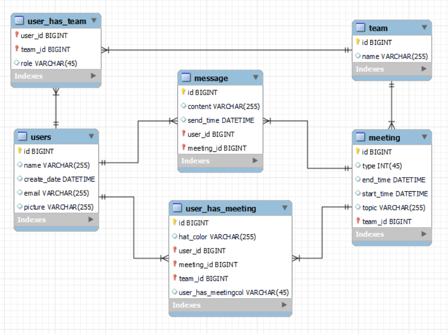

## **Architure**

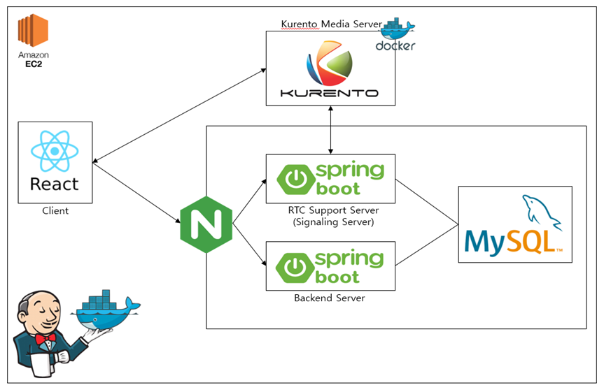

## **육색모자기법**

> 에드워드 드 보노(Edward de Bono)가 개발한 아이디어 발상법으로 평등한 발언권을 가진 사람들이 각각 모자에 따라 역할을 나누는 기법

참조 : [입장 바꿔 생각해보자! 육색 사고 모자 활동](https://if-blog.tistory.com/7162)

- 초록모자
  - 창조적 사고, 새로운 아이디어
  - 추자적 대안들, 가능성, 가정
- 노란모자
  - 사물에 대한 긍정적인 사고
  - 타당성 검토(논리적)
- 빨간모자
  - 감정, 본능, 육감
  - 행동에 사과하거나 납득 시킬 필요 없이 감정대로 진행
- 검정모자
  - 판사 역할, 비판적 판단
  - 적합과 부적합의 지적
- 하얀모자
  - 객관적, 중립적, 정보 전달
  - 필요/부족/원하는 정보의 판별 및 획득방법 제시
- 파란모자
  - 의제 선정, 단계 진행, 요약/결론/결정
  - 사고 과정의 조직화 및 통제

## 주요 기능

### 네비게이션 바

- 로그인 전

우리는 로그인 기능을 Google OAuth 로그인을 활용하여 구현하였다. 처음 우리 사이트에 접속하였을 대 구글 로고를 클릭하여 로그인을 할 수 있다.

- 로그인 후

로그인이 완료되면 위와 같은 네비게이션 바로 변경이 된다.

### 메인페이지

메인페이지는 우리의 웹 사이트의 목적과 육색모자기법에 대한 기본적인 설명을 적어두어 사용자들의 이해를 돕고자 하였다.

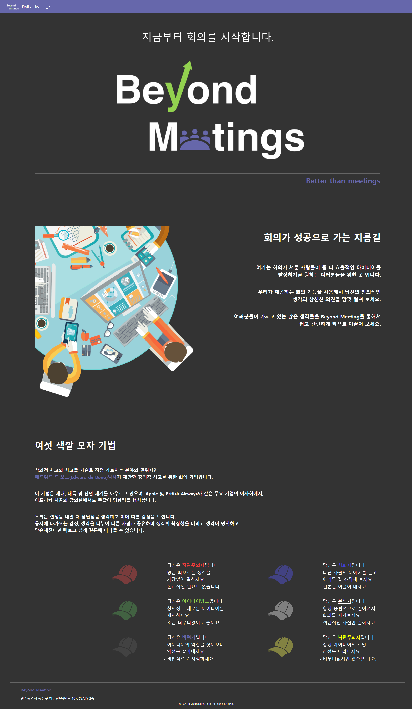

### 프로필 페이지

웹 사이트 사용자들의 회의 참여를 유도하기 위해 육색모자기법을 활용한 회의에서 자신이 착용한 모자의 기록을 시각화 하여 보여주는 프로필 페이지 이다.

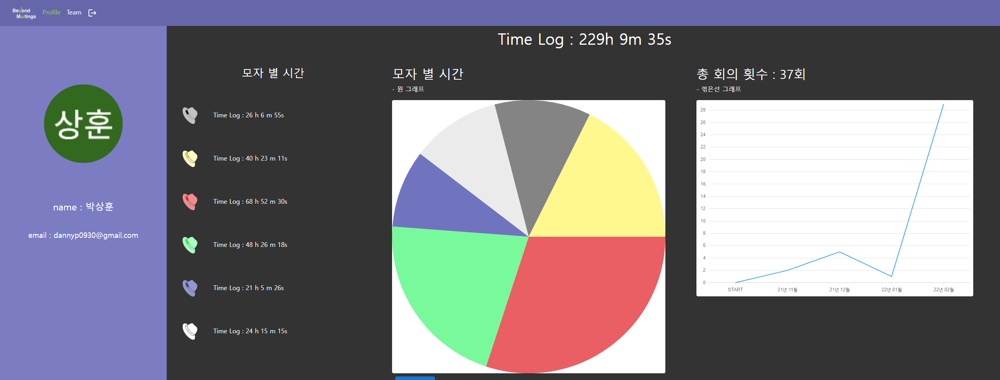

아래의 자세히 보기 버튼을 누르면 가장 많이 착용한 모자의 색깔과 기록을 보여준다.

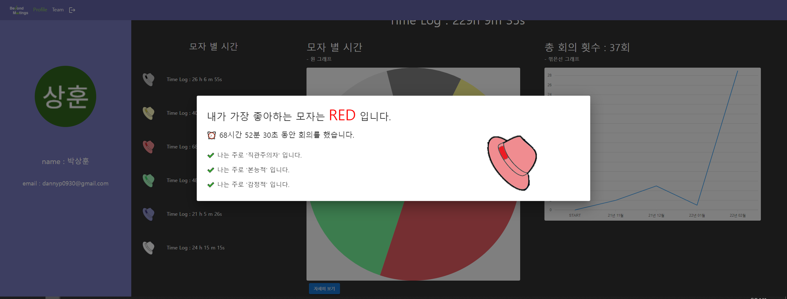

### 팀페이지

- 팀 목록

  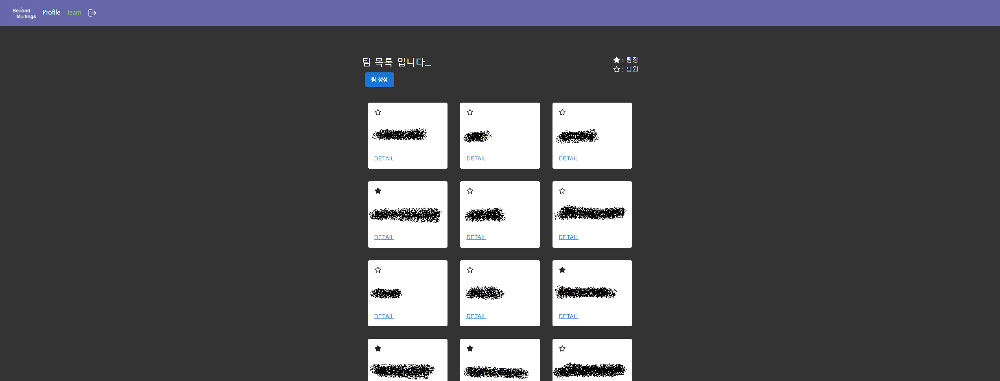

  팀 목록 페이지에서 내가 속한 팀의 간단한 정보를 조회할 수 있다. 별표 표시를 통해 자신의 팀장 여부를 확인할 수 있다. DETAIL 링크를 통해 팀 페이지로 이동할 수 있다.

  - 팀 생성

    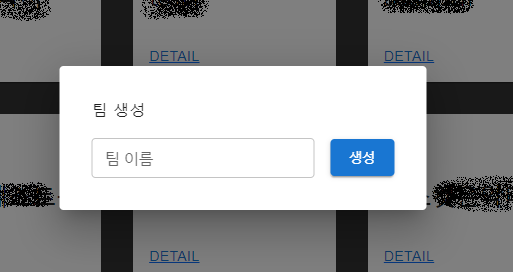

  팀 생성 버튼을 클릭하면 팀 이름을 설정하는 모달을 통해 새로운 팀을 생성할 수 있다.

- 회의 목록

  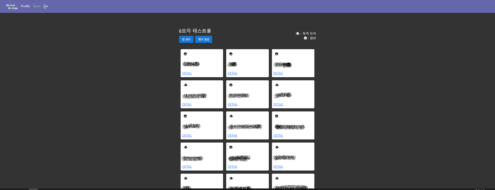

  DETAIL 링크를 통해 들어온 팀 상세 페이지 이다. 진행 중 이거나 완료된 회의를 볼 수 있다. 이모지를 통해서 일반 회의와 육색모자 회의를 구별할 수 있다. 팀장인 경우에만 팀 관리, 회의 생성 버튼을 볼 수 있다.

  - 팀 관리

    

    자신이 팀장인 경우 팀 관리 버튼을 클릭하여 팀을 관리할 수 있다. 팀 이름을 수정하거나 팀원을 추가 삭제 할 수 있다. 팀을 삭제하는 기능 또한 가능하다.

  - 회의 생성

    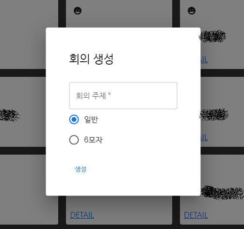

    회의 생성 버튼을 눌러 새로운 회의를 생성할 수 있다. 일반 또는 6모자를 선택하여 생성하고자 하는 회의의 종류를 결정할 수 있다.

### 회의 페이지

팀 상세 페이지에서 생성된 회의 목록들은 NOW ON과 DETAIL 링크가 다르다. NOW ON은 회의가 진행 중 이라는 뜻으로 클릭하면 회의 페이지로 이동한다. DETAIL의 경우 회의 결과 페이지로 이동한다.

- 회의 진행

  - 육색모자기법을 선택한 경우

    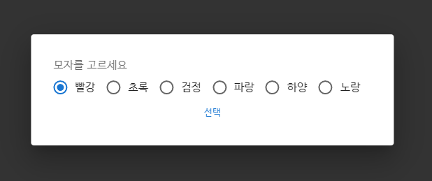

    이 경우에는 회의에 처음 참여할 때 한 번 자신의 모자를 선택할 수 있다. 선택이 완료되면 그룹 통화에 참여가 가능하다.

  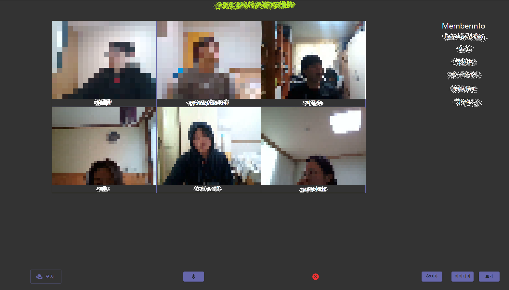

  회의 화면에 들어오면 상단에 회의 주제를 확인할 수 있다. 또 오른쪽에 회의에 참여중인 인원을 확인할 수 있고 우측 하단의 참여자 버튼을 토글하여 정보를 가릴 수 있다.

  - 모자 설명

    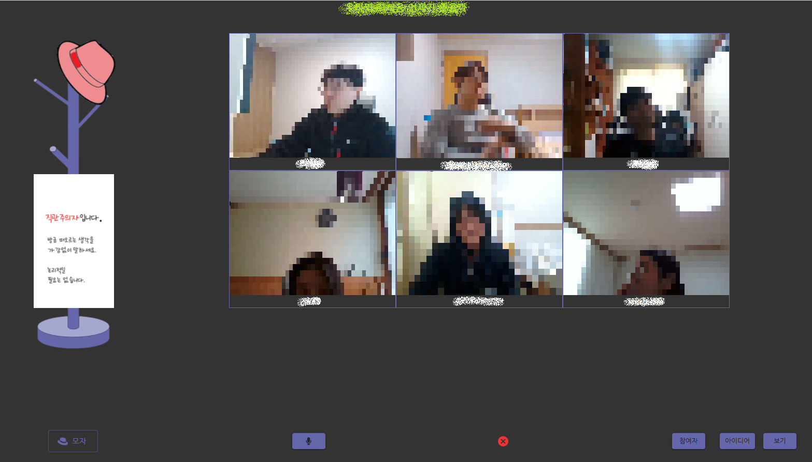

    좌측 하단의 모자 버튼을 토글하여 내가 선택한 모자 정보를 확인하여 내가 어떠한 자세로 회의에 참여해야 하는 지 확인할 수 있다.

  - 아이디어 보드

    아이디어 버튼을 클릭하여 이 회의에 대한 아이디어를 정리할 수 있다.

    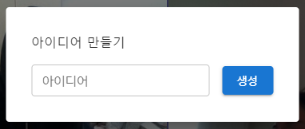

    보기 버튼을 클릭하면 현재 제출된 아이디어 리스트를 확인할 수 있다.

    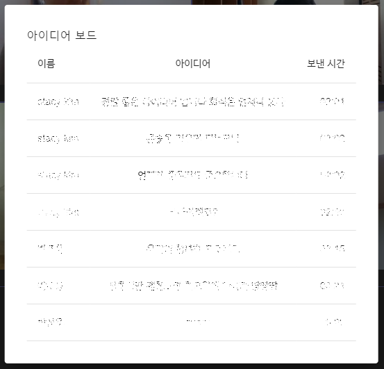

- 회의 결과

  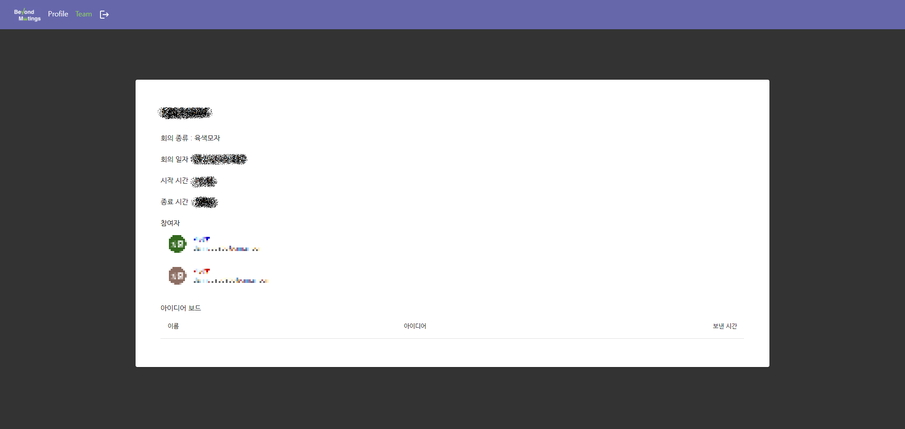

회의 상세 내용이다. 회의 종류, 회의 일자 시간 등 기본적인 정보와 참여자, 아이디어 보드에 대한 내용을 확인 할 수 있다.
